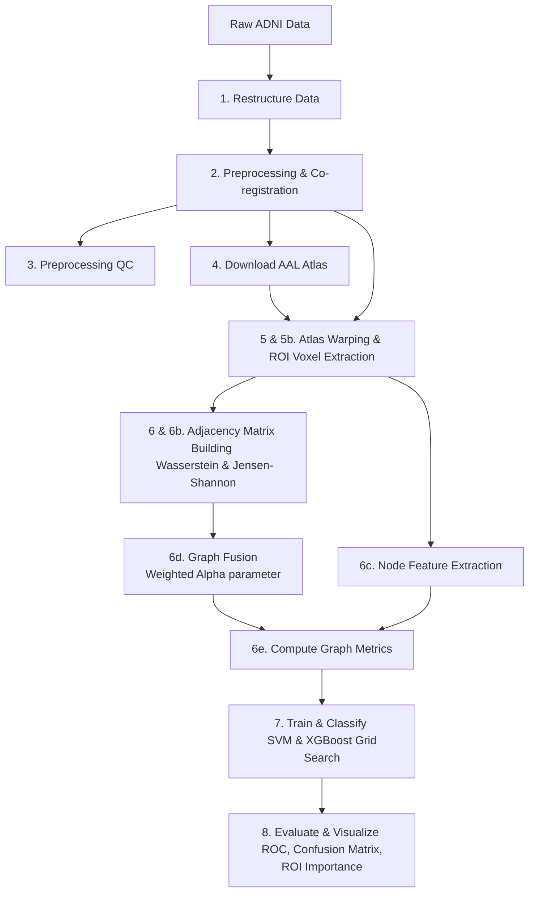

# Multimodal PET-MRI Individual Brain Graph Analysis for Alzheimer's Disease Diagnosis

This repository contains a multimodal pipeline to construct and analyze subject-specific brain connectivity graphs from MRI and PET images to classify Alzheimer's Disease (AD) vs. Cognitively Normal (CN) subjects. It leverages structural morphology (MRI) and metabolic network activity (PET) at an individual level.

---

## 📌 Pipeline Overview

The pipeline consists of the following sequential stages:



### 1. Data Restructuring & Preprocessing
*   **`1-restructure_adni.py`**: Re-organizes raw ADNI inputs into structured subject-specific folders.
*   **`2-preprocess_adni.py`**: Performs T1-bias correction, skull-stripping, intensity clipping, co-registration of PET to MRI, and spatial alignment.
*   **`3-generate_qc.py`**: Produces quality control verification plots for the skull-stripping and alignment stages.
*   **`4-atlas_download.py`**: Automatically downloads and caches the MNI152-space AAL3 (Automated Anatomical Labeling) brain template.

### 2. Deformable Atlas Registration & Voxel Extraction
*   **`atlas_registration.py` [NEW]**: A robust registration module utilizing ANTs (Symmetric Normalization - `SyN` or `Affine` registration) to warp the AAL atlas from MNI space into each subject's native MRI space. Resolves critical axis misalignments and coordinate system differences (LPS $\leftrightarrow$ RAS conversions) to guarantee perfect parcellation alignment.
*   **`5-extract_roi_voxels.py`**: Warps the atlas and extracts PET metabolic voxel distributions per ROI.
*   **`5b-extract_mri_roi_voxels.py`**: Reuses the cached warped atlas from Step 5 to extract structural MRI voxel distributions per ROI.

### 3. Individual Brain Connectivity & Graph Fusion
*   **`6-build_adjacency.py`**: Calculates Wasserstein distance between ROI voxel distributions to form individual metabolic PET graphs.
*   **`6b-build_mri_adjacency.py`**: Computes Jensen-Shannon divergence to construct morphological structural MRI networks.
*   **`6c-build_node_features.py`**: Extracts descriptive statistics (mean, std, skewness, kurtosis) per ROI.
*   **`6d-fuse_graphs.py`**: Integrates PET and MRI networks using a weighted fusion matrix:
    $$W_{\text{fused}} = \alpha \cdot W_{\text{PET}} + (1 - \alpha) \cdot W_{\text{MRI}}$$
*   **`6e-compute_graph_metrics.py`**: Computes complex network parameters (degree, clustering coefficient, betweenness centrality, local efficiency, and eigenvector centrality) from the fused brain network.

### 4. Classification & Diagnostics Evaluation
*   **`7-classify.py`**: Implements SVM and XGBoost classifiers with K-Fold cross-validation to search for optimal fusion parameter $\alpha \in \{0.3, 0.5, 0.7\}$.
*   **`8-evaluate.py`**: Performs test-set validation, produces ROC and confusion matrix visualizations, and computes biomarker feature importance based on connection weight differences.

---

## 📈 Experimental Results (AD vs. CN Classification)

### 1. Cross-Validation Grid Search Results
During the cross-validation phase on the training set, we evaluated both SVM and XGBoost across different multimodal fusion fractions ($\alpha$ represents PET weighting):

*   **XGBoost ($\alpha = 0.3$)**: **AUC = 0.909** | **BACC = 0.845** 🌟 *(Best Performance)*
*   **XGBoost ($\alpha = 0.5$)**: **AUC = 0.907** | **BACC = 0.831**
*   **SVM ($\alpha = 0.3$)**: **AUC = 0.890** | **BACC = 0.801**
*   **SVM ($\alpha = 0.5$)**: **AUC = 0.886** | **BACC = 0.810**
*   **XGBoost ($\alpha = 0.7$)**: **AUC = 0.887** | **BACC = 0.811**

*Morphological network structure (MRI) weighted higher ($1 - \alpha = 0.7$) combined with metabolic networks (PET, $\alpha = 0.3$) yielded the highest predictive accuracy.*

### 2. Final Holdout Test Set Performance
Evaluating the optimal model configuration (XGBoost, $\alpha = 0.3$) on the unseen test set yielded strong generalization scores:

| Metric | Score |
| :--- | :--- |
| **ROC AUC** | **0.8781** |
| **Accuracy** | **84.21%** |
| **Balanced Accuracy (BACC)** | **84.21%** |
| **Sensitivity (Recall)** | **84.21%** |
| **Specificity** | **84.21%** |
| **F1-Score** | **84.21%** |

---

## 🧠 Brain Regions of High Diagnostic Importance (Biomarkers)

Analysis of network edge differences ($|\text{AD}_{\text{mean}} - \text{CN}_{\text{mean}}|$) highlights significant connectivity divergence in classic hallmark Alzheimer's regions:

1.  **Posterior Cingulate Gyrus (`Cingulum_Post_L`)**: Shows the highest network connectivity difference, especially in connections with cerebellar vermis regions.
2.  **Angular Gyrus (`Angular_L`, `Angular_R`)**: Exhibits severe metabolic and structural co-alterations.
3.  **Precuneus (`Precuneus_L`, `Precuneus_R`)**: Key hub of the Default Mode Network (DMN), displaying structural degradation reflected in Jensen-Shannon divergence features.
4.  **Inferior Temporal Gyrus (`Temporal_Inf_L`)**: Demonstrates substantial differences in regional distribution statistics between the groups.

---

## ⚙️ How to Run the Pipeline

Ensure that you have activated the correct environment (containing `ants`, `nibabel`, `nilearn`, `scikit-learn`, `xgboost`):

Execute the pipeline sequentially from data preparation to evaluation:

```bash
# 1. Data Restructuring & Preprocessing
python 1-restructure_adni.py
python 2-preprocess_adni.py
python 3-generate_qc.py
python 4-atlas_download.py

# 2. Registration & Voxel Extraction
# Note: Step 5 performs heavy non-linear registration (SyN) by default.
# It caches the warped atlas so Step 5b runs instantly.
python 5-extract_roi_voxels.py
python 5b-extract_mri_roi_voxels.py

# 3. Graph Construction & Feature Extraction
python 6-build_adjacency.py
python 6b-build_mri_adjacency.py
python 6c-build_node_features.py

# 4. Graph Fusion & Metrics
python 6d-fuse_graphs.py
python 6e-compute_graph_metrics.py

# 5. Model Training & Evaluation
python 7-classify.py
python 8-evaluate.py
```

All figures (ROC curve, confusion matrix, and average group brain network connectivity) are saved in the `outputs/figures/` directory. Numerical reports are saved in `outputs/results/`.
